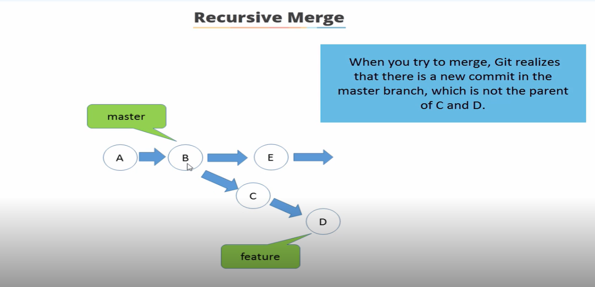
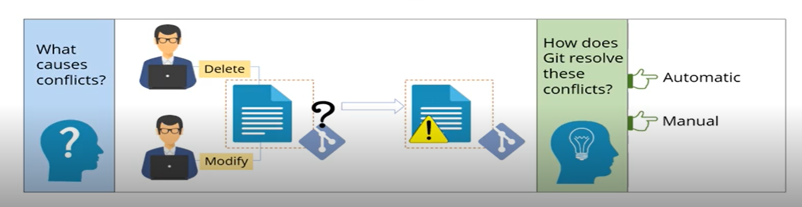

## Tracking Files

. Show difference in a file

    git diff <filename>

. difference in the file in working directory

    git status
    git diff --staged

## Reverting to earlier commit

1. Execute git log : it will list details of the commit associated with a file
2. Execute git checkout : this will stage the file
3. Execute git status : Share the command to unstage the file
4. Execute git reset : this will remove the file from staging area

you can use the git checkout command to revert to an earlier version , you can refer to the commit id shows by git log command,
the you need to commit it.

## Deleting files in git 
this command will delete the file from staging area and working directory

    git rm <filename>

Want to delete from staging area only ? use this command:

    git rm --cached <filename>

the files removed from the staging area, will be marked as 'untracked' in the git status

## Branches 
    
to create a new branch use this command :

    git branch <branch name>

to list the branch in the current repositories use this command:

    git branch 

to switch branches use this command : 

    git checkout <branch name>

to merge a branch use this command : 

    git merge <branch name>

to create a new branch and switch to it use : 

    git checkout -b <branch name> 

Note: When a new branch is created the complete commit history of the master branch is replicated 

## Merging 
before you merge two branches it's important to analyse the difference between them to prevent conflicts, you can use the git diff command for that purpose. 

    exemple : git diff master..featureone

1. Switch to the branch you want to merge to
   
2. Execute this command an replace branch name with the name of the branch you want to merge files.
   
        git merge <branch name>

## Types of merging in git 
There are two type of merging in git : The Fast forward and The Recursive Merge

    Fast forward merge is employed when you merge into a branch, the latest commit of which is your parent.

Please watch this video to understand well how Fast foward merge works perfectly :

    Recursive Merge is the default merge employed by git to deal with the mutiple berge bases.Git create a merge base and merges recursively.
    
Please watch this video to understand well how Fast foward merge works perfectly :

A recursive merge is done when you have a branch master, which is not the parent of your branch commit.
Here B is the parent of C and D commits made on the feature branch

When you try to merge, Git realizes that there is a new commit in the master branch , which is not the parent of C and D.
unlike the fast foward merge, in recursive merge git creates another commit and bring all the changes into this additional commit.

## Conflicts 
What causes conflicts ? 
Suppose two users change the same line in a file, one of them want to delete while the other just want to modify it. In such case, this is unable to find the correct one, so it shows the file into confilcts.

How does git resolves these conflicts ?
There are times when git resolves this automaticaly but it generally ask for a manual merge.

### Cloning In Git 
Cloning helps in creating a copy of the repository and links it to the original repository.The duplicate repository is sync with the original repository.This is the cloning command in git, you write git clone followed by what you want to clone and the target

    git clone <URLoftherepo> <URLofwherewillbelocalrepo>